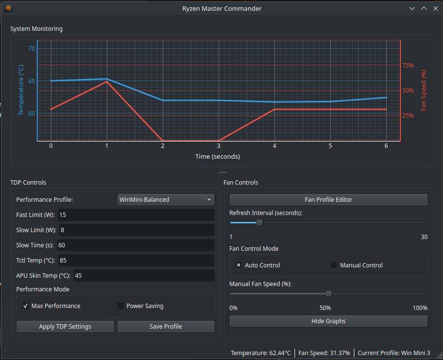
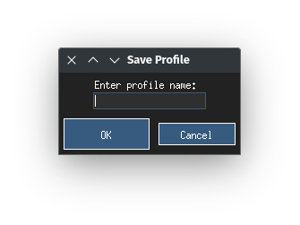
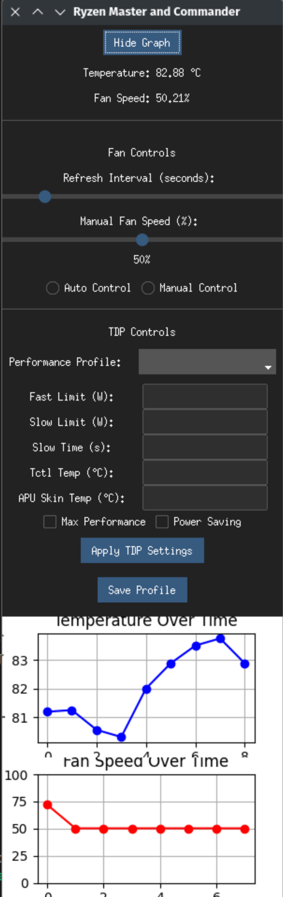

# Ryzen Master & Commander 🚀

Ryzen Master & Commander is a Python-based GUI application for monitoring and controlling Ryzen-based systems, with a focus on the GPD Win Mini. It provides features such as temperature and fan speed monitoring, fan control, and TDP (Thermal Design Power) settings management. 🌡️💨🔧


*The main user interface of Ryzen Master Commander*

## Features ✨

- Real-time temperature and fan speed monitoring with graphs 📈
- Manual and automatic fan speed control 🌬️
- TDP settings management with customizable profiles ⚙️
- User-friendly GUI built with ttkbootstrap 🎨

Here's a Quick Start guide that you can add to your README.md file:

## Quick Start 🚀

To get started with Ryzen Master Commander quickly, follow these steps:

### Prerequisites

Make sure you have the following dependencies installed on your system:

- Python 3.6 or higher 🐍
- TCL and Tk libraries 🖼️
- `nbfc` and `ryzenadj` command-line tools 🔧

#### Installing Dependencies on Arch Linux

```
sudo pacman -S python tcl tk nbfc ryzenadj
```

#### Installing Dependencies on Debian-based Systems (Ubuntu, Debian, etc.)

```
sudo apt update
sudo apt install python3 python3-pip tcl tk nbfc ryzenadj
```

### Installation

Install Ryzen Master Commander using pip:

```
pip install ryzen-master-commander
```

### Running the Application

Launch Ryzen Master Commander by running the following command:

```
ryzen-master-commander
```

The application will prompt you for your sudo password, which is required for controlling the fan speed and applying TDP settings. 🔑

That's it! You're now ready to use Ryzen Master Commander to monitor and control your Ryzen-based system. Enjoy! 😊

You can add this Quick Start guide to your README.md file to provide users with a concise set of instructions to get up and running with Ryzen Master Commander quickly. Feel free to adjust the wording or formatting as needed to fit the style of your README.


### Installing from Source

To install Ryzen Master Commander from source, follow these steps:

1. Clone the repository:

```
git clone https://github.com/sam1am/Ryzen-Master-Commander.git
```

2. Navigate to the project directory:

```
cd Ryzen-Master-Commander
```

3. Install the required Python packages:

```
pip install -e .
```

This command installs the package in editable mode, allowing you to make changes to the source code and have them immediately reflected in the installed package. 🎉

## Usage 🚀

To launch Ryzen Master Commander, run the following command:

```
ryzen-master-commander
```

The application will prompt you for your sudo password, which is required for controlling the fan speed and applying TDP settings. 🔑

## Screenshots 📷


*Saving a custom TDP profile*


*Real-time temperature and fan speed monitoring with graphs*

## Contributing 🤝

Contributions to Ryzen Master Commander are welcome! If you find a bug, have a feature request, or want to contribute code, please open an issue or submit a pull request on the [GitHub repository](https://github.com/yourusername/Ryzen-Master-Commander). 😊

## License 📜

This project is licensed under the [Apache License 2.0](LICENSE).

## Acknowledgements 🙏

Ryzen Master Commander was developed on Arch Linux for the GPD Win Mini, but it should work on other Ryzen-based devices as well. Special thanks to the developers of the `nbfc` and `ryzenadj` tools, which make this application possible. 👏