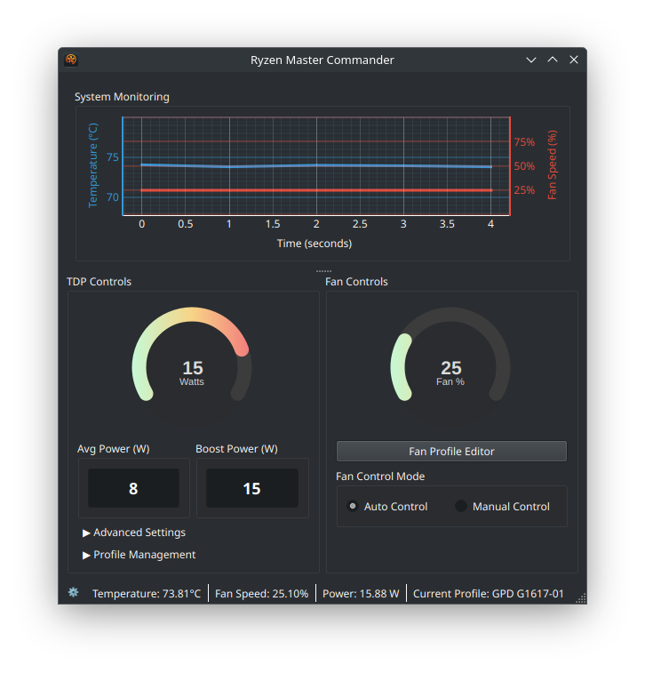

# Ryzen Master & Commander 🚀

Ryzen Master & Commander is a Linux GUI application for monitoring and controlling Ryzen-based systems, with a focus on handhelds with newer Ryzen chipsets like those from GPD. It provides features such as temperature and fan speed monitoring, fan control, and TDP (Thermal Design Power) settings management. 🌡️💨🔧


*The main user interface of Ryzen Master Commander*

## Features ✨

- Real-time temperature and fan speed monitoring with graphs 📈
- Manual and automatic fan speed control 🌬️
- Fan profile editor for creating custom fan curves for NBFC ✏️
- TDP settings management with customizable profiles ⚙️
- User-friendly GUI built with PyQt5 🎨

## Quick Start 🚀

To get started with Ryzen Master Commander quickly, follow these steps:

### Installation

#### Arch Linux (and derivatives like Manjaro)

Ryzen Master Commander is available on the AUR (Arch User Repository). You can install it using an AUR helper like `yay` or `paru`:

```bash
yay -S ryzen-master-commander
```
or
```bash
paru -S ryzen-master-commander
```

This will also install `nbfc` (from community or AUR) and `ryzenadj` (from community or AUR) if they are listed as dependencies in the PKGBUILD and are not already installed.

### Running the Application

Launch Ryzen Master Commander by running the following command in your terminal:

```bash
ryzen-master-commander
```

The application will prompt you for your sudo password (via `pkexec`) when necessary, which is required for controlling the fan speed and applying TDP settings. 🔑

That's it! You're now ready to use Ryzen Master Commander to monitor and control your Ryzen-based system. Enjoy! 😊

## Usage 🚀

After installation, launch Ryzen Master Commander from your application menu or by running the command:

```bash
ryzen-master-commander
```

The application uses `pkexec` for operations requiring root privileges (like applying TDP settings with `ryzenadj` or controlling fans with `nbfc`). You will be prompted for your password by the system's polkit agent.

## Contributing 🤝

Contributions to Ryzen Master Commander are welcome! If you find a bug, have a feature request, or want to contribute code, please open an issue or submit a pull request on the [GitHub repository](https://github.com/sam1am/Ryzen-Master-Commander). 😊

## License 📜

This project is licensed under the [MIT License](LICENSE).

## Acknowledgements 🙏

Ryzen Master Commander was developed on Arch Linux for the GPD Win Mini, but it should work on other Ryzen-based devices where `nbfc-linux` and `ryzenadj` are supported. Special thanks to the developers of the `nbfc`, `nbfc-linux`, and `ryzenadj` tools, which make this application possible. 👏
