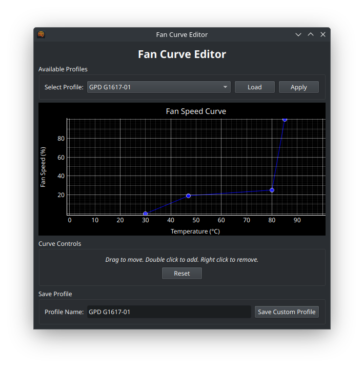

# Ryzen Master & Commander 🚀

Ryzen Master & Commander is a Linux GUI application for monitoring and controlling Ryzen-based systems. It provides features such as temperature and fan speed monitoring, fan control, a fancy fan curve editor, and TDP control.


*The main user interface of Ryzen Master Commander*

## Features ✨

- Real-time temperature and fan speed monitoring with graphs 📈
- Manual and automatic fan speed control 🌬️
- Fan profile editor for creating custom fan curves for NBFC ✏️
- TDP settings management with customizable profiles ⚙️
- User-friendly GUI built with PyQt5 🎨



## Quick Start 🚀

To get started with Ryzen Master Commander quickly, follow these steps:

### Installation

#### Arch Linux (and derivatives like Manjaro)

Ryzen Master Commander is available on the AUR (Arch User Repository). You can install it using an AUR helper like `yay` or `paru`:

```bash
yay -S ryzen-master-commander
```
or
```bash
paru -S ryzen-master-commander
```

This will also install `nbfc` (from community or AUR) and `ryzenadj` (from community or AUR) if they are listed as dependencies in the PKGBUILD and are not already installed.

#### Debian (Ubuntu, Mint, etc.)

A .deb is available in the latest build. It has not yet been tested and is considered experimental. Report any issues you run into. 

### Running the Application

Launch Ryzen Master Commander by running it from your desktop environment or running the following command in your terminal:

```bash
ryzen-master-commander
```

The application will prompt you for your sudo password when necessary, which is required for controlling the fan speed and applying TDP settings. 

## Usage

The top of the window shows a graph with a recent history of fan speed and temperature. 

The view can be dragged via the handle in the middle to resize or hide the top or bottom panel. 

Bottom left: TDP controls let you select a saved performance profile, manually set values for Fast Limit, Slow Limit, Slow Time, Tctl Temp, and APU Skin Temp. Addiotnally, you can set Max Performance or Power Saving Mode. You can apply settings and save new profiles. 

Bottom right: There is a fan profile editor for creating fan curves. The rrfresh interval controls how often the graph is refreshed. The fan speed can be set to manual, which will be controlled by the Manual Fan Speed slider or Auto, which will follow the current fan curve profile. A hide graphs button lets you toggle the visibility of the graphs. 

At the bottom you will see the current temperature, fan speed, and current fan curve profile. 

## Contributing 🤝

Contributions to Ryzen Master Commander are welcome! If you find a bug, have a feature request, or want to contribute code, please open an issue or submit a pull request on the [GitHub repository](https://github.com/sam1am/Ryzen-Master-Commander). 😊

## License 📜

This project is licensed under the [MIT License](LICENSE).

## Acknowledgements 🙏

Ryzen Master Commander was developed on Arch Linux for the GPD Win Mini, but it should work on other Ryzen-based devices where `nbfc-linux` and `ryzenadj` are supported. Special thanks to the developers of the `nbfc`, `nbfc-linux`, and `ryzenadj` tools, which make this application possible. 👏
